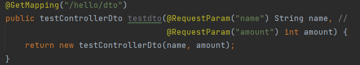
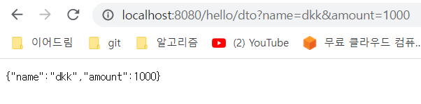

Spring boot 3일차
---

### 1. lombok
롬복은 자바 개발할 때 자주 사용하는 코드 Getter, Setter, 기본 생성자, toString 등을 어노테이션으로 자동 생성해 준다.

롬복은 build gradle에 의존성을 추가해서 사용가능하다.

- compileOnly 'org.projectlombok:lombok'

>의존성 옵션
>
>1.compile을 사용하는 경우
A모듈을 수정하게 되면 A를 의존하는 모든 모듈이 rebuild 된다. (시간이 오래걸린다)
>
>2.implementation을 사용하는 경우
A모듈을 수정하게 되면 A를 직접적으로 의존하는 모듈까지만 rebuild 한다.(빠르다)
>
>
>
>implementation 장점
>
>1.빠르다.
>
>직접적으로 의존하는 모듈까지만 rebuild해주기 때문에.
>
>2.API 노출을 막는다.
>
>사용자에게 필요이상의 API를 노출하는 것은 불필요하다.(Facade 패턴)
>compile을 사용하면 연결된 모든 모듈의 API가 노출된다.
> 
>
>  의존성 옵션들 
>1. implementation: 의존 라이브러리 수정시 본 모듈까지만 재빌드한다.
본 모듈을 의존하는 모듈은 해당 라이브러리의 api 를 사용할 수 없음
>
>2. api: 의존 라이브러리 수정시 본 모듈을 의존하는 모듈들도 재빌드
본 모듈을 의존하는 모듈들도 해당 라이브러리의 api 를 사용할 수 있음
>
>3. compileOnly: 이름에서 알 수 있듯이 compile 시에만 빌드하고 빌드 결과물에는 포함하지 않는다.
runtime 시 필요없는 라이브러리인 경우 (runtime 환경에 이미 라이브러리가 제공되고 있는가 하는 등의 경우)
>
>4. runtimeOnly: runtime 시에만 필요한 라이브러리인 경우
>
>5. annotationProcessor: annotation processor 명시 (ex:lombok)
>
>6. testImplementation : 테스트 코드를 수행할 때만 적용.
> 
> 출처 https://cantcoding.tistory.com/59

 ### Dto 생성 및 Test

Data Transfer Object - 계층 간에 데이터 교환을 위한 객체를 이야기

뷰 템플릿 엔진에서 사용될 객체나 Repository Layer에서 결과로 넘겨준 객체 등이 있다.

여기서도 Controller에 Data를 넘겨주기 위해 생성
testController에서 /hello/dto api에서 해당 dto class를 생성하고 반환해준다.
    생성하기 위해서 @RequestParam 어노테이션 사용 - 외부에서 API로 넘긴 파라이머를 가져오는 어노테이션

get 방식으로 data를 넘겨 받을때 @RequestParam 사용한다.

