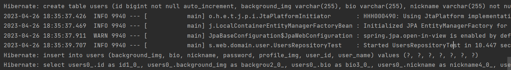

Spring boot 4일차
---

### 1. Entity 클래스와 JPA_Repository 클래스

Entity 클래스는 실제 DB의 테이블과 매칭될 클래스이다. Jpa를 사용하면 DB 데이터에 작업할 경우
실제 쿼리를 날리기보다는, 이 Entity 클래스의 수정을 통해 작업한다.

JPA_Repository 클래스는 Entity 클래스로 Database를 접근하게 해준다.
Dao라고 불리는 DB layer 접근자이다.

인터페이스로 생성하며 인터페이스 생성 후 JpaRepository<Entity 클래스, pk 타입>를 상속하면
기본적인 CRUD 메소드가 자동으로 생성된다.

주의할 점은 Entity 클래스와 Repository 클래스는 함께 위치 해야한다.  
둘이 아주 밀접한 관계이고, Entity 클래스는 기본 Repository 없이는 제대로 역할을 할 수 가 없다.

Repository 클래스 Test
save, findall 기능 테스트

UsersRepositoryTest file

@After
- junit에서 단위 테스트가 끝날 때마다 수행되는 메소드를 지정
- 보통은 배포 전 전체 테스트를 수행할 때 테스트간 데이터 침범을 막기 위해 사용

.save()
- 지정된 테이블에 insert/update 수행
- id 값이 있다면 update가, 없다면 insert 쿼리 실행

.findall()
- 테이블 posts에 있는 모든 데이터를 조회해오는 메소드

test 진행 시 실제로 실행된 쿼리 보기

create, insert, select 쿼리가 실행 된 것을 볼 수 있다.

회원가입 API 만들기
api를 만들기 위해 총 3개의 클래스가 필요
- request 데이터를 받을 dto
- api 요청을 받을 Controller
- 트랜잭션, 도메인 기능 간의 순서를 보장하는 Service

