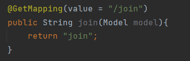
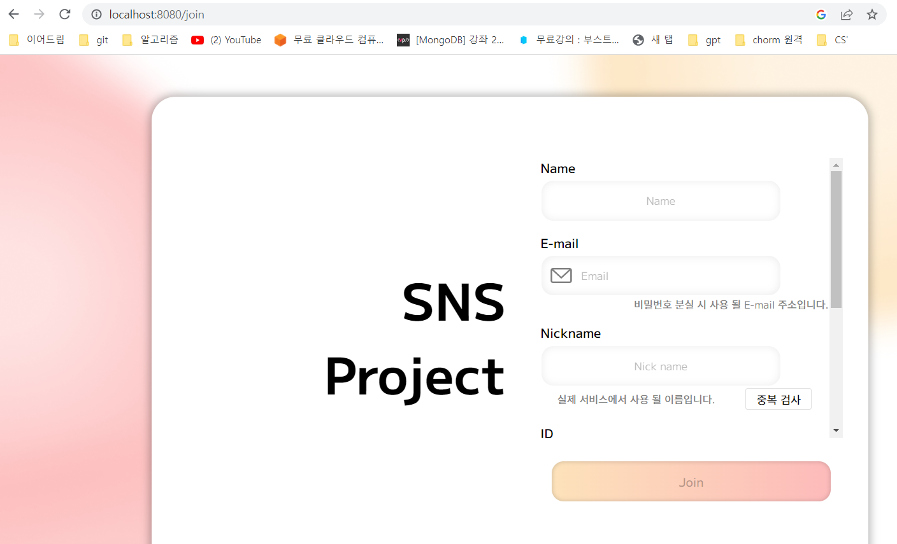

Spring boot 4일차
---

### 1. 회원가입 구현

회원가입을 위한 비지니스 로직  
1. api controller를 통해 회원가입 http 확인  
  @PostMapping 어노테이션 사용  
2. controller에서 service 객체 생성 -> service의 save 함수 호출 
3. Service에서 save 함수에 데이터를 넘겨줄때는 dto를 통해 넘겨준다.
4. dto에서는 toEntity를 통해 jpaRepository를 사용해서 데이터베이스에 접근


#### - Entity 클래스에 직접 접근하지 않는다!!!
entity 클래스를 절대로 request/response 클래스로 사용하지 않는다.  
dto가 entity와 완전 유사하더라도 항상 dto를 통해 데이터를 다뤄야한다.

entity 클래스는 데이터베이스와 맞닿은 핵심 클래스이다. 
entity 클래스를 기준으로 테이블이 생성되고 ,스키마가 변경된다.

수많은 서비스 클래스나 비지니스 로직들이 entity 클래스를 기준으로 동작한다. 
entity 클래스가 변경되면 여러 클래스에 영향을 끼친다.


#### - Service에서 비지니스 로직을 처리하지 않는다!!!
Service는 트랜잭션, 도메인 간 순서 보장의 역할만 한다.
비지니스 로직처리는 domain에서 진행한다.

### 회원가입 페이지를 위한 html 파일
템플릿은 Pebble Template 사용

java Template에는 여러가지가 있다. mustache, Timeleaf 등등  
이중에서 Pebble을 선택한 이유는 python의 jinja template와 문법이 유사하기때문이다.  

#### Pebble Template란?  

Pebble은 Java 기반의 템플릿 엔진입니다. HTML과 같은 마크업 언어와 Java 코드를 조합하여 동적인 웹 페이지를 생성할 수 있습니다. Pebble은 매우 높은 생산성과 유연성을 제공하며, Spring Boot와 같은 Java 기반의 웹 프레임워크와 함께 사용하기에 이상적입니다.

Pebble은 다음과 같은 기능
- 상속과 include 기능을 제공하여 템플릿 코드의 재사용성을 높임
- 변수, 제어 구문, 필터 등을 사용하여 동적인 페이지 생성 가능

Pebble을 사용하기 위한 의존성 추가

```
implementation 'io.pebbletemplates:pebble-spring-boot-starter:3.1.5'
```

pebble도 머스테치와 마찬가지로 확장자명이 pebble이다.  
하지만 설정을 통해 .html로도 사용가능하다.
```aidl
application.properties 파일

pebble.suffix= .html
```

이렇게 까지 했으면 pebble template 설정이 끝났다.  
pebble의 기본 path도 다른 template와 마찬가지로 resources/templates/이다.

  
이제 위와 같이 mapping 시키면 templates/join.html 파일이 열리게 된다



pebble에서 주의할점은 Controller 어노테이션을
@RestController이 아니라 @Controller로 해야한다는 점이다.


#### @RestController 와 @Controller의 차이점

>Spring MVC의 @RestController은 @Controller와 @ResponseBody의 조합입니다.
>
>Spring 프레임 워크에서 RESTful 웹 서비스를 보다 쉽게 개발할 수 있도록 Spring 4.0에서 추가되었습니다.
>
>근본적인 차이점은 @Controller의 역할은 Model 객체를 만들어 데이터를 담고 View를 찾는 것이지만,  
>@RestController는 단순히 객체만을 반환하고 객체 데이터는 JSON 또는 XML 형식으로 HTTP 응답에 담아서 전송합니다.  
>물론 @Controller와 @ResponseBody를 사용하여 만들 수 있지만  
>이러한 방식은 RESTful 웹서비스의 기본 동작이기 때문에 Spring은  
>@Controller와 @ResponseBody의 동작을 조합한 @RestController을 도입했습니다.
> 