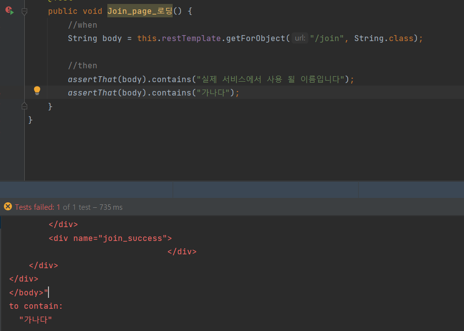

Spring boot 5일차
---

#### 회원가입 개발 진행

### 1. template를 연결하기 위한 controller
다른 프로젝트 예시를 따로 찾아보진 않았지만 template를 열기 위한 controller를 따로 만들고
작업하는 것이 관리 측면에서도, 가시성 측면에서도 좋아 보이기 때문에 template를 위한 controller인
indexController Class 생성

### 2. indexController Test 
```java
    @Test
    public void Join_page_로딩() {
        //when
        String body = this.restTemplate.getForObject("/join", String.class);

        //then
        assertThat(body).contains("실제 서비스에서 사용 될 이름입니다");
    }

```
위 테스트 코드에서 assertThat(body).contains()를 통해 해당 내용이 있는지 없는지를 확인한다.
해당 html 내용의 위치는 어디든 상관없다.

없는 내용으로 테스트해보면 테스트케이스 실패


### 3. Join Html 파일을 위한 JS 작성
js의 경우 ajax를 통해 form 태그로 입력 받은 회원가입 정보들을 
UsersApiController의 save 함수에 보내준다.
그 후 login 페이지로 이동시킨다.

```javascript

var join = {
    save : function (){
        var data = {
            user_name : $('#user_name').val(),
            user_email : $('#user_email').val(),
            nickname: $('#nickname').val()
            pw2: $('#pw2').val()
        };

        $.ajax({
            type: 'POST',
            url: '/api/v1/users',
            dataType: 'json',
            contentType: 'application/json;charset=utf-8',
            data: JSON.stringify(data)
        }).done(function(){
            alert('글이 등록되었습니다.');
            window.location.href = '/login';
        }).fail(function(error){
            alert(JSON.stringify(error));
        })
}
```
join.js에서 위 코드를 통해 회원가입 버튼을 누르면 
api/v1/users에 mapping 되어있는 save 함수 호출
성공적으로 ajax 통신이 이루어졌다면 login 페이지로 넘어간다.

